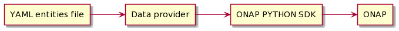

Description
===========

Data provider is a project to provide a tool to automate common ONAP resource creation.
For many of tasks in ONAP some resources are needed and could be created once, like cloud region, complex or customer in A\&AI.
With that tool it can be automated to create them for every ONAP instance. It can be also used to create requested resource on already running
instance on demand.

Data provider reads data needed to be created from YAML files. YAML schema is described in the relevant section.

Project is written in Python is based on the `ONAP Python SDK <https://python-onapsdk.readthedocs.io/en/latest/>`_ library and uses it for all
communication with ONAP components. All ONAP SDK features (like settings custom URLs for ONAP instance) could be used.

The data flow is described by diagram below:

